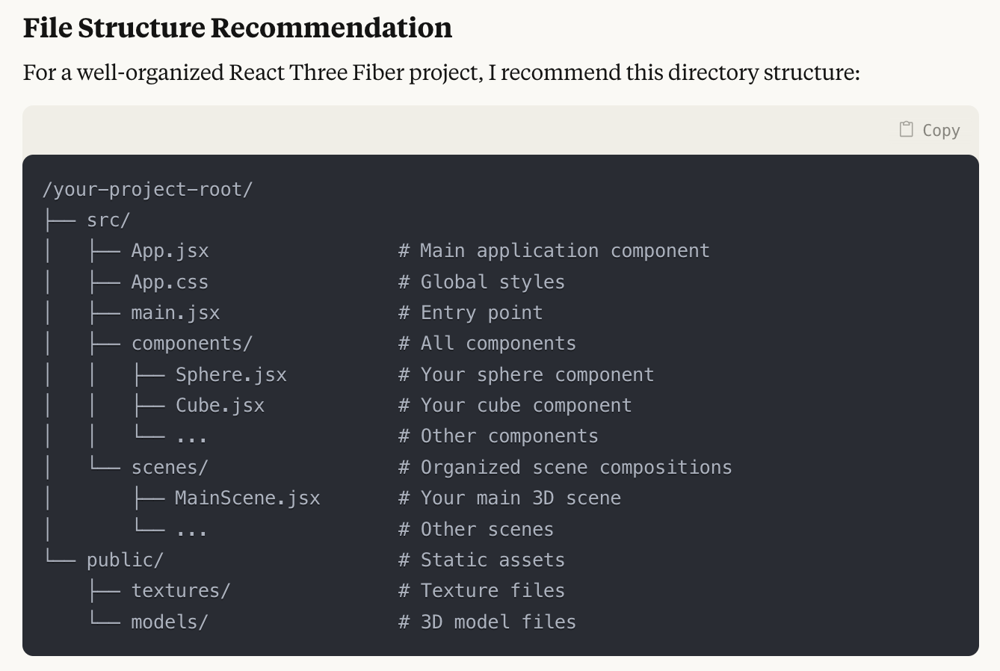
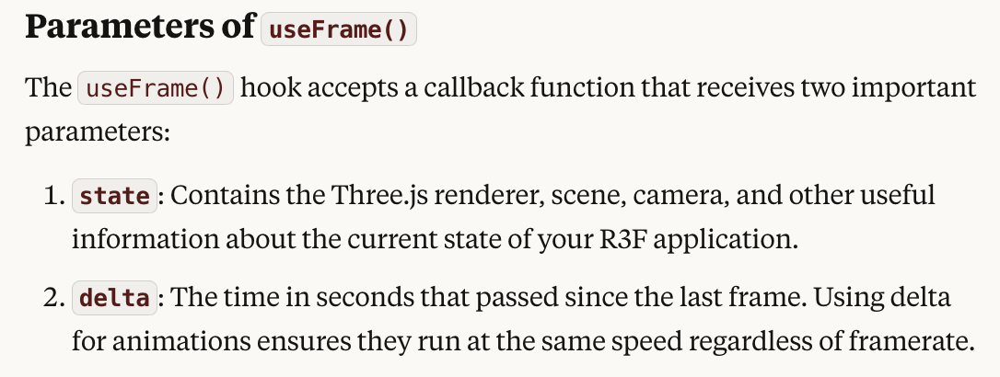

# 3js Learning Materials

## 3js File Structure Recommendation



### Canvas

- The canvas is the area where the 3D object is rendered.
- The canvas is created using the <canvas> tag.

### Scene

- The scene is the container for all the 3D objects.
- The scene is created using the <scene> tag.

### Camera

- The camera is the point of view from which the 3D object is viewed.
- The camera is created using the <perspectiveCamera> tag.

### Perspective Camera

- Component in React Three Fiber (r3f) sets up a perspective camera in your 3D scene. This camera is used to view the 3D object from different angles, and most often used.
- The perspective camera is created using the <perspectiveCamera> tag.
- The perspective camera has three main properties: fov, aspect, and near and far.
  - fov: The field of view of the camera in degrees. The field of view is the extent of the observable world that is seen at any given moment.
  - aspect: The aspect ratio of the camera. The aspect ratio is the ratio of the width of the camera to the height of the camera.
  - near: The distance from the camera to the near clipping plane. Objects closer to the camera than the near clipping plane are not rendered.
  - far: The distance from the camera to the far clipping plane. Objects farther from the camera than the far clipping plane are not rendered.

#### Example

```javascript
<PerspectiveCamera makeDefault position={[0, 0, 5]} fov={45} />
```

- PerspectiveCamera - This creates a perspective camera, which mimics how human eyes perceive depth (objects farther away appear smaller).
  makeDefault
- This prop makes this camera the default for the scene. If you have multiple cameras, this one will be used unless you explicitly activate another.
- position={[0, 0, 5]} - This positions the camera at coordinates [x, y, z]:

  - x: 0 (centered horizontally)
  - y: 0 (centered vertically)
  - z: 5 (5 units away from the origin on the z-axis, essentially backing the camera away from the scene)

- fov={45} - Sets the Field of View to 45 degrees. This determines how wide the camera's view is. Lower values create a more "zoomed in" view, higher values create a wider angle view.

This camera setup would be looking directly at the center of your scene (0,0,0) from 5 units back, with a moderate 45-degree field of view.

### Renderer

- The renderer is the object that renders the 3D object on the canvas.
- The renderer is created using the <renderer> tag.

### Position and Args

- The Args property sets the shape and the size of the object within the <mesh> tag.
  
  

### Rotation

- The rotation property sets the rotation of the object within the <mesh> tag.

## Lighting

### Light

- The light property sets the light source for the 3D object.
- The light property is created using the <ambientLight> tag.

### Directional Light

- The directional light property sets the direction of the light source for the 3D object.
- The directional light property is created using the <directionalLight> tag.

### Point Light

- The point light property sets the point of the light source for the 3D object.
- The point light property is created using the <pointLight> tag.

### Spot Light

- The spot light property sets the spot of the light source for the 3D object.
- The spot light property is created using the <spotLight> tag.

### Hemisphere Light

- The hemisphere light property sets the hemisphere of the light source for the 3D object.
- The hemisphere light property is created using the <hemisphereLight> tag.

### Ambient Light

- The ambient light property sets the ambient light source for the 3D object. Illuminates all objects in the scene equally.
- This light cannot be used to cast shadows as it does not have a direction.
- The ambient light property is created using the <ambientLight> tag.

### Environment

The <Environment preset="night" /> component in React Three Fiber (r3f) sets up environmental lighting and background for your 3D scene. Here's what it does:

- Environment - This component provides image-based lighting (IBL) for your scene, which creates realistic reflections and ambient lighting.
  preset="night" - This uses a pre-configured lighting environment that simulates a nighttime setting. The "night" preset typically creates:

* Dark blue/black ambient lighting that mimics night sky
* Subtle, lower-intensity lighting that creates a nighttime mood
* Appropriate highlights and reflections on objects with reflective materials

- The Environment component is particularly useful for:

* Creating consistent lighting across your entire scene
* Adding realistic reflections to shiny or metallic materials
* Setting the overall mood and ambience of your 3D environment
* Avoiding the need to manually position multiple light sources

- This single line effectively gives your scene a nighttime atmosphere with appropriate lighting without having to manually configure multiple light sources and their properties.
- Other common presets include "sunset", "dawn", "city", "park", "lobby", etc., each providing different lighting characteristics and moods.

- For the <Environment> component in React Three Fiber, you have several ** preset options ** beyond just "night". Here are the available presets you can use:

"sunset" - Warm orange/golden lighting that simulates sunset
"dawn" - Soft pinkish/blue lighting of early morning
"night" - Dark blue/black lighting that simulates nighttime
"warehouse" - Industrial lighting with strong shadows
"forest" - Green-tinted lighting filtered through trees
"apartment" - Indoor residential lighting
"studio" - Clean, neutral studio lighting
"city" - Urban lighting with artificial light sources
"park" - Natural daylight in an open space
"lobby" - Interior architectural lighting

- You can use any of these by simply changing the preset value:

```jsx
<Environment preset="sunset" />
<Environment preset="warehouse" />
<Environment preset="studio" />
```

- You can also control additional properties of the Environment component:

`````jsx
<Environment
  preset="sunset"
  background={true} // Set to false if you only want the lighting without changing the background
  blur={0.5} // Controls background blur (0-1)
  intensity={1} // Controls the overall intensity of the environment lighting
/>
````jsx
Try different presets to see which one best fits the mood and style you want for your scene!


## Animation

- The animation property sets the animation for the 3D object.
- The animation property is created using the <animation> tag.

### useFrame()

- The useFrame() hook is a special feature specific to react-three-fiber., not a general React hook or part of Three.js itself.
- The useFrame() function is used to create an animation loop for the 3D object. It allows you to execute code on every frame of the animation, which runs at 60 frames per second.
- It is similar to the requestAnimationFrame() function in JavaScript.
- It is used to update the position, rotation, and scale of the 3D object.
- The useFrame() function takes a callback function as an argument, which is called on every frame of the animation loop.

```javascript
import React, { useRef } from "react";
import { useFrame } from "@react-three/fiber";

export function RotatingSphere() {
  // Create a reference to our mesh
  const meshRef = useRef();

  // This function runs on every frame
  useFrame((state, delta) => {
    // Rotate the mesh a little bit each frame
    meshRef.current.rotation.y += delta * 0.5;
  });

  return (
    <mesh ref={meshRef}>
      <sphereGeometry args={[1, 32, 32]} />
      {/* args={[radius, widthSegments, heightSegments]} */}
      <meshStandardMaterial color="#3a86ff" />
    </mesh>
  );
}
`````


