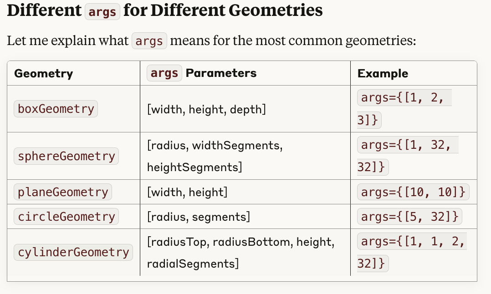

# 3js Learning Materials

### Canvas

- The canvas is the area where the 3D object is rendered.
- The canvas is created using the <canvas> tag.

### Scene

- The scene is the container for all the 3D objects.
- The scene is created using the <scene> tag.

### Camera

- The camera is the point of view from which the 3D object is viewed.
- The camera is created using the <perspectiveCamera> tag.

### Renderer

- The renderer is the object that renders the 3D object on the canvas.
- The renderer is created using the <renderer> tag.

### Position and Args

- The Args property sets the shape and the size of the object within the <mesh> tag.
  
  

### Rotation

- The rotation property sets the rotation of the object within the <mesh> tag.

### Light

- The light property sets the light source for the 3D object.
- The light property is created using the <ambientLight> tag.

### Directional Light

- The directional light property sets the direction of the light source for the 3D object.
- The directional light property is created using the <directionalLight> tag.

### Point Light

- The point light property sets the point of the light source for the 3D object.
- The point light property is created using the <pointLight> tag.

### Spot Light

- The spot light property sets the spot of the light source for the 3D object.
- The spot light property is created using the <spotLight> tag.

### Hemisphere Light

- The hemisphere light property sets the hemisphere of the light source for the 3D object.
- The hemisphere light property is created using the <hemisphereLight> tag.

### Animation

- The animation property sets the animation for the 3D object.
- The animation property is created using the <animation> tag.

# React + Vite

This template provides a minimal setup to get React working in Vite with HMR and some ESLint rules.

Currently, two official plugins are available:

- [@vitejs/plugin-react](https://github.com/vitejs/vite-plugin-react/blob/main/packages/plugin-react/README.md) uses [Babel](https://babeljs.io/) for Fast Refresh
- [@vitejs/plugin-react-swc](https://github.com/vitejs/vite-plugin-react-swc) uses [SWC](https://swc.rs/) for Fast Refresh

## Expanding the ESLint configuration

If you are developing a production application, we recommend using TypeScript and enable type-aware lint rules. Check out the [TS template](https://github.com/vitejs/vite/tree/main/packages/create-vite/template-react-ts) to integrate TypeScript and [`typescript-eslint`](https://typescript-eslint.io) in your project.
